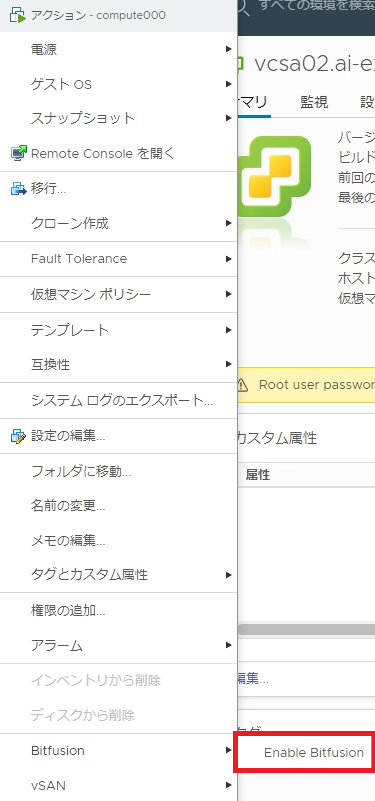

# Setup Bitfusion Client for Ubuntu
## Install Git

---
```
$ sudo apt update
$ sudo apt -y install git
```

## Clone repogitory
---
```
$ cd && git clone https://github.com/y-yas/Bitfusion_Client_Setup/
```

## Download Bitfusion client
---
bitfusion version 2.5.1.-13(2021/02/12時点での最新)をインストール
```
$ ./Bitfusion_Client_Setup/setup_ubuntu.sh
```

```
https://my.vmware.com/en/web/vmware/downloads/info/slug/datacenter_cloud_infrastructure/vmware_vsphere_bitfusion/3_0
```


## Enable Bitfusion client
---
Bitfusionサーバと同一vCenterインスタンスの場合はEnableを実施
対象のクライアントサーバはEnable前にPowerOff




## Deploy Client Token
---
ベアメタルサーバ、Bitfusionサーバとは別のｖCenterで管理される仮想マシンの場合はTokenを利用

1. vSphere Client で、[メニュー ] > [[Bitfusion]] 
2. [トークン] タブで [新規トークン] 
3. [トークンの作成] ダイアログ ボックスで、説明を入力し、[作成] 
4. リストからトークンを選択し、[ダウンロード] をクリックして、tar ファイルをローカル マシンに保存
5. tar ファイルをクライアント マシンのファイルシステムにコピーし、解凍

- ca.crt を /etc/bitfusion/tls にコピー
- client.yaml を ~/.bitfusion にコピー
- servers.conf を ~/.bitfusion にコピー

## Add user to bitfusion group（enable、token 共通）
---
```
$ sudo usermod -aG bitfusion $USER
```
再ログイン


